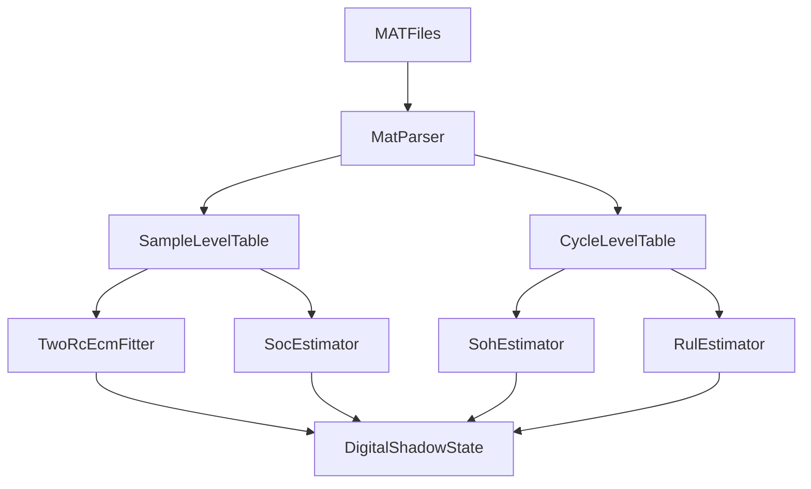

# Li-ion Digital Shadow Implementation Plan

## Goal
Create a notebook-first digital shadow for the batteries in [mat_files](c:\Users\hp\Downloads\analysis\mat_files) that:
- loads the NASA `.mat` files (`B0005`, `B0006`, `B0007`, `B0018`)
- standardizes charge, discharge, and impedance cycles into analysis-ready tables
- estimates `SOC`, `SOH`, and `RUL`
- fits a `2RC` Thevenin ECM to represent terminal voltage dynamics
- exposes current, voltage, temperature, and health trajectories as a usable shadow state

## Existing Inputs
- [mat_files/README.txt](c:\Users\hp\Downloads\analysis\mat_files\README.txt) documents the cycle schema and available signals.
- The dataset structure supports:
  - discharge-cycle capacity for `SOH`
  - cycle count / capacity fade progression for `RUL`
  - terminal voltage, current, temperature, and time for `SOC` and ECM fitting
  - `Re` and `Rct` impedance parameters that can inform health tracking and ECM parameter drift

## Proposed Deliverables
- [implementation.md](c:\Users\hp\Downloads\analysis\implementation.md)
  - architecture, assumptions, formulas, milestones, and validation plan
- Notebook-first workflow, likely under a new `notebooks/` folder:
  - `01_load_and_flatten_mat.ipynb`
  - `02_feature_engineering_and_targets.ipynb`
  - `03_soc_soh_rul_and_ecm.ipynb`
- Supporting Python modules under a lightweight `src/` package if notebook cells start getting too large:
  - `src/data_loader.py`
  - `src/features.py`
  - `src/ecm.py`
  - `src/state_estimators.py`
  - `src/rul.py`

## Technical Approach
### 1. Data ingestion and normalization
Parse each battery’s `cycle` structure from the `.mat` files and normalize it into three aligned tables:
- `charge_cycles`
- `discharge_cycles`
- `impedance_cycles`

For each cycle, retain metadata such as battery id, cycle index, operation type, timestamp, ambient temperature, and the raw measurement arrays.

Then derive two granularities:
- sample-level records for ECM and SOC estimation
- cycle-level records for SOH/RUL estimation

### 2. Core digital-shadow state
Represent the battery shadow as a per-cycle and per-sample latent state:
- observable inputs: current, terminal voltage, temperature, elapsed time
- estimated states: `SOC`, `SOH`, `RUL`, `V1`, `V2`
- slowly varying parameters: `R0`, `R1`, `C1`, `R2`, `C2`

### 3. SOC estimation
Start with coulomb counting as the baseline SOC estimator:
- integrate current over time during charge/discharge
- clamp to `[0, 1]`
- reset or correct drift using voltage-based anchors near full charge / end-of-discharge

If needed, extend to an observer later:
- EKF/UKF over the `2RC` ECM using terminal voltage residuals

### 4. SOH estimation
Build cycle-level health targets from discharge capacity:
- `SOH = capacity / initial_capacity`

Use the strongest features identified in the reports:
- discharge energy
- discharge duration
- voltage statistics / voltage drop
- temperature rise
- `Re`, `Rct`, and `Re + Rct`

Initial modeling plan:
- baseline: direct capacity/SOH computation from discharge cycles
- learned estimator: regularized regression for interpretable SOH estimation, with room for tree models if cross-battery validation supports them

### 5. RUL estimation
Define RUL in cycles remaining until `SOH <= 80%` or capacity reaches EOL threshold from the README.

Use a staged approach:
- baseline: degradation-curve extrapolation from fitted SOH trend per battery
- improved model: cycle-level supervised regressor using trend and impedance features

Given the small number of batteries, emphasize leave-one-battery-out validation over random splits.

### 6. 2RC ECM fitting
Fit a `2RC` Thevenin ECM to discharge/charge voltage trajectories:
- terminal model: `Vt = OCV(SOC) - I*R0 - V1 - V2`
- RC branch dynamics estimated from current excitation and voltage response

Planned steps:
- estimate OCV-SOC lookup from low-current / relaxed voltage points where possible
- initialize `R0`, `R1`, `C1`, `R2`, `C2` from pulse-like regions or optimization heuristics
- fit per-cycle or per-window parameters via least squares / constrained optimization
- smooth parameters across cycles so the digital shadow evolves realistically with aging

### 7. Temperature representation
For the first version, temperature will be observation-driven rather than fully thermal-model-driven:
- ingest measured `Temperature_measured`
- derive `temp_rise` and thermal summaries
- expose temperature in the shadow state and correlate it with resistance growth

A thermal submodel can be added later if needed.

## Validation Strategy
- ingestion checks: confirm cycle counts and required fields for each battery
- SOC sanity: bounds, monotonicity during discharge/charge, drift checks
- SOH sanity: monotonic degradation trend and agreement with measured capacity
- RUL sanity: extrapolated EOL close to observed EOL on held-out batteries
- ECM sanity: compare reconstructed vs measured terminal voltage using RMSE/MAE

## Build Order
1. Document the architecture and assumptions in [implementation.md](c:\Users\hp\Downloads\analysis\implementation.md)
2. Create the notebook/project skeleton and dependency file
3. Implement MAT parsing and flattened sample/cycle tables
4. Add feature engineering for SOH/RUL and battery diagnostics
5. Implement baseline SOC estimator and discharge-capacity-based SOH pipeline
6. Implement and fit the `2RC` ECM, then reconstruct terminal voltage
7. Add RUL estimation and validation plots across batteries
8. Refine notebook outputs into a repeatable digital-shadow workflow

## Key Assumptions
- The first version is offline and dataset-driven, not a live streaming service.
- Notebook-first means analysis and modeling will be runnable from notebooks, with helper modules extracted only where they improve reuse.
- Temperature is represented from measured data in v1; a full coupled thermal model is deferred.
- `2RC` ECM fidelity is the target from the start, but parameter estimation will likely begin with a robust baseline rather than a highly optimized physics fit.

## Risks To Manage
- MATLAB file schema may differ slightly across files and require defensive parsing.
- The dataset is small at the battery level, so RUL generalization must be validated carefully.
- Accurate `OCV(SOC)` estimation may be limited without long rest periods; fallback approximations may be necessary.
- ECM parameter fitting can be ill-conditioned unless constrained and smoothed across cycles.